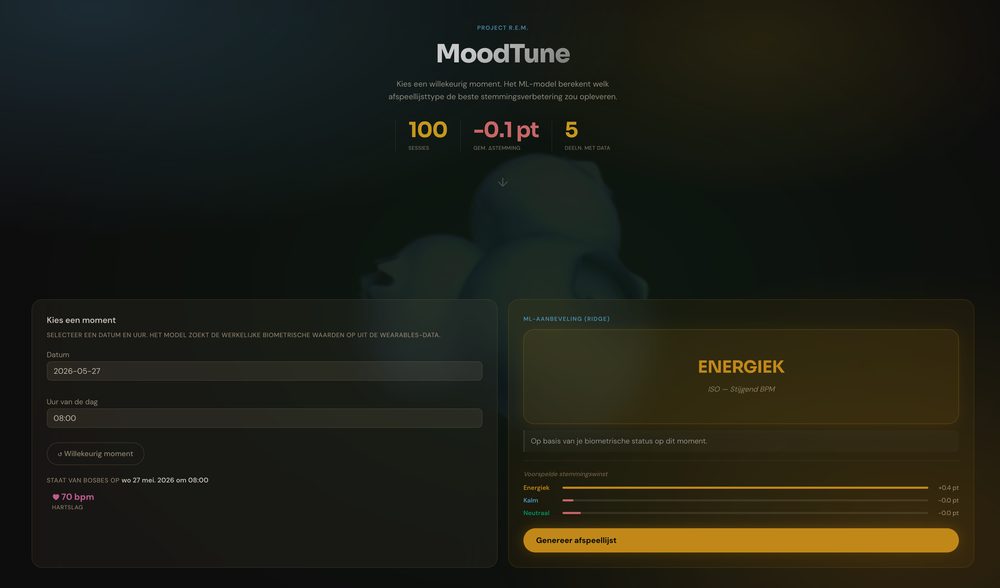

# Project R.E.M.

**Regulation of Emotion through Music** — VDO Data Scientist Eindwerk, Syntra

[](https://python.org)
[](https://scikit-learn.org)
[](https://github.com/astral-sh/uv)
[](ui/app.py)
[](LICENSE)
[](#)


Onderzoekt of gepersonaliseerde ISO-geordende afspeellijsten (kalm / neutraal / energie) de emotionele toestand meetbaar kunnen sturen, gekoppeld aan biometrische smartwatchdata en zelfgerapporteerde stemming. *(Spoiler: hoe je je voelt vóór de sessie weegt zwaarder door dan je hartslagdata. Wij waren ook verrast!)*

<p align="center">
  
</p>

---

## Vereisten

- **Python 3.12+** en **[uv](https://github.com/astral-sh/uv)**
- **Windows:** gebruik Git Bash of WSL; voer `uv sync --no-group analysis` uit om zware ML-pakketten (jax, pymc, torch) over te slaan als je enkel de app nodig hebt

```bash
curl -LsSf https://astral.sh/uv/install.sh | sh
```

---

## Quick start

```bash
# 1. Eerste keer instellen
./bootstrap.sh

# 2. Zet de databestanden klaar (zie Datastructuur hieronder), en start daarna de biometrische pipeline
./scripts/pipeline.sh --all

# 3. Genereer ML-uitvoer — standaard snel (~1–3 min), models/ is al ingecheckt
./scripts/notebooks.sh

# 4. Start de app
./ui/run_app.sh          # → http://127.0.0.1:8000
```

> Alle scripts accepteren `--help`. Voer `./bootstrap.sh --check` uit om je datamappen te controleren.

---

## Projectstructuur

```
spotify-project/
├── scripts/
│   ├── pipeline.sh          ← extractie → baseline → sessies
│   ├── notebooks.sh         ← alle 4 ML-notebooks → app-uitvoer
│   ├── playlists.sh         ← afspeellijstgeneratie voor een deelnemer
│   ├── extraction/          ← Fase 1: ruwe wearable-exports → per-minuut CSVs
│   ├── baseline/            ← Fase 2: circadiaanse baselines + herstelcurves
│   ├── sessions/            ← Fase 3: sessie-effecten + significantietests
│   ├── playlists/           ← ISO-afspeellijstgenerator (spotify_cli.py)
│   └── analysis/            ← Losse scripts: Bayesiaans, LSTM, ML-classifiers
├── notebooks/ml/            ← Vier ML-notebooks (zie hieronder)
├── ui/
│   ├── app.py               ← Shiny-app toegangspunt
│   └── modules/             ← Per-pagina Shiny-modules
└── data/                    ← Ruwe data genegeerd door git; verwerkte uitvoer ingecheckt
```

---

## Handige commando's

| Taak | Commando |
|------|---------|
| Volledige pipeline (alle deelnemers) | `./scripts/pipeline.sh --all` |
| Specifieke deelnemers | `./scripts/pipeline.sh bosbes peer` |
| Geforceerde herstart | `./scripts/pipeline.sh --all --force` |
| Fase overslaan | `./scripts/pipeline.sh --all --skip-extraction` |
| ML-notebooks (snel, standaard) | `./scripts/notebooks.sh` |
| ML-notebooks (volledig hertrainen) | `./scripts/notebooks.sh --fresh` |
| Afspeellijsten genereren | `./scripts/playlists.sh <codenaam>` |
| App met hot-reload | `./ui/run_app.sh --reload` |

---

## Notebooks → App-uitvoer

De vier notebooks in `notebooks/ml/` lopen na de biometrische pipeline en schrijven alles wat de app nodig heeft. Opgeslagen modellen zijn ingecheckt, dus de standaard run exporteert CSVs en grafieken opnieuw zonder hertraining.

| Notebook | Produceert |
|----------|---------|
| `1_circadian_ml.ipynb` | Ridge/RF/GBM-resultaten, SHAP-grafieken, RQ3 confusion matrix |
| `2_bayesian_recommender.ipynb` | Bayesiaanse posteriors, `recommendations.json` |
| `3_music_class_supervised.ipynb` | `classified_songs.csv` per deelnemer |
| `4_music_class_unsupervised.ipynb` | GMM-clusterindeling, PCA-scatter |

Notebooks 3 en 4 hebben `feature_matrix.csv` nodig (aangemaakt door de biometrische pipeline). Notebook 2 is onafhankelijk.

---

## Datastructuur

Zet de invoerbestanden hier klaar voor de pipeline:

```
data/
├── checkins/
│   └── Check-in_formulier_REM.csv    ← Google Forms-export
├── playlists/
│   └── <codenaam>/                   ← Exportify-CSVs per deelnemer
└── wearables/
    └── <codenaam>/
        └── raw/export/               ← Garmin-ZIPs of Huawei-JSONs
```

Deelnemers gebruiken fruitcodenamen: `bosbes`, `kokosnoot`, `limoen`, `peer`, `kiwi`, `watermeloen`, `aardbei`, `citroen`.

> `data/wearables/*/raw/` is genegeerd door git — commit nooit ruwe exports (die bevatten persoonsgevoelige deelnemersdata).

---

## Opmerkingen

- **SSL op conda:** als `uv sync` mislukt met `UnknownIssuer`, voer dan `SSL_CERT_DIR="" SSL_CERT_FILE="" uv sync` uit
- **Bug in check-in datum:** mobiele Google Forms kan dag en maand omwisselen; `scripts/extraction/checkin_utils.py::fix_checkin_dates()` corrigeert dit automatisch met een waarschuwing
- **Nog geen testomgeving:** voer `uv run python -m py_compile <bestand>` uit voor een syntaxcheck voor je commit — we leven gevaarlijk

---

**Contact:** rem.studie@gmail.com
